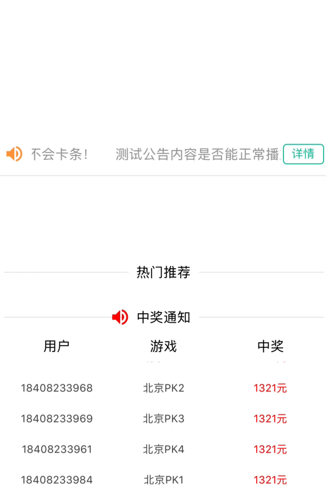

## Screenshots



# react-naitve-SeamlessScroll
react-native 简单的无缝平滑滚动组件 用于横向或纵向的平滑滚动

## Browsers

* support ios and android

## Install

```ssh
    npm install react-native-seamless-scroll
    yarn add react-native-seamless-scroll
```

## Usage

```jsx
import { SeamlessScroll } from 'react-native-seamless-scrolls';

<SeamlessScroll scrolltime={8000} direction='row' meter={20} styles={{ width: 320, flexDirection: 'row' }}>
  <View style={{ paddingRight: 20 }}>
    <Text>
      测试公告内容是否能正常播放，会不会卡条！
    </Text>
  </View>
  <View>
    <Text style={styles.noticeText}>
      测试公告内容是否能正常播放，会不会卡条！
    </Text>
  </View>
</SeamlessScroll>
```

## API

|   属性         |                       说明                       |  类型   |   默认值    |
| ---------------| ------------------------------------------------ | ------- | ----------- |
| direction      | 必选 方向 默认纵向'vertical' 横向'row'               | string  | ``vertical`` |
| meter          | 选填 调节参数（在滚动元素有padding或margin时做对应调节，或处理ios和android兼容调节）| number  | ``0`` |
| styles         | 必选 对应的滚动适口宽度或高度（width或height）一般为滚动元素总高（宽）度| Object  | ``null`` |
| scrolltime     | 滚动一个周期所需时间（毫秒）                              | number  | ``5000`` |


